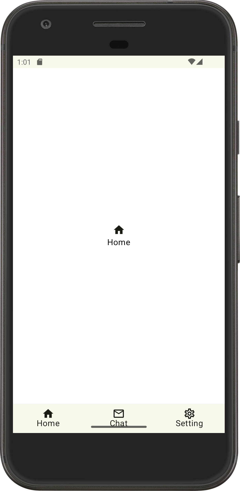
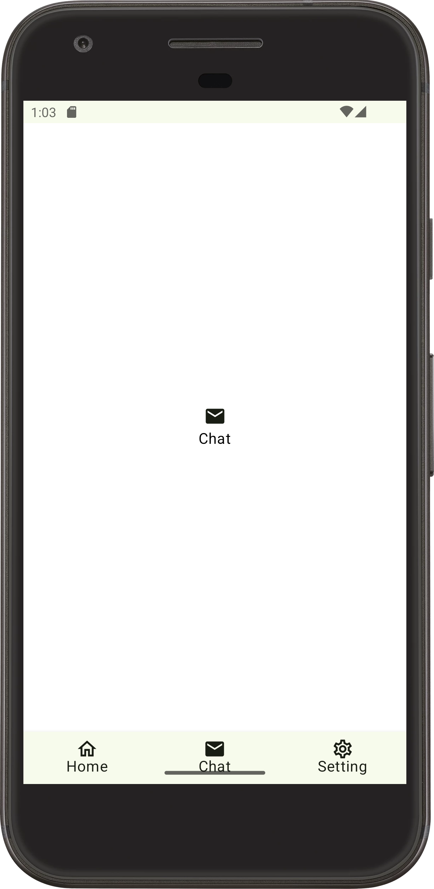
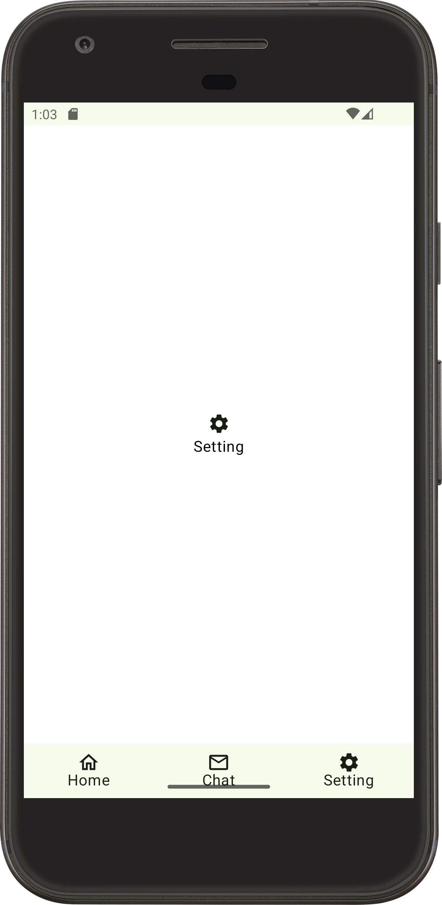

# BottomNavigation-JetpackCompose
Bottom Navigation Bar is one of the most widely used feature in apps. This bottom bar can be used to navigate to different screens within an app.

## 🌳 Environment
Android Studio verison used : ``Android Studio Ladybug | 2024.2.1 Patch 2``

## 🖼️ OutPut Screens

| Home Screen | Chat Screen | Setting Screen |
|-------------|---------------|---------------|
| | | |
